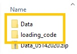

# Welcome to UMMC Simband Dataset!

## Preparation

Please download the [Data](https://drive.google.com/file/d/1Sw73g2IRzBPs9K19lQozsc64KwX2PHbM/view?usp=sharing), unzip it and name the folder as `Data`.

Please put this code folder and the `Data` folder under same root folder, like this:

## How to Run

Hit `F5` and run [main](./main.m).

- First, select subject:
  - Input `0` to run all subjects;
  - Input `1` to `41` to run specific subject listed.

- Second, select segment:
  - Input `0` to run all segments in selected subject(s);
  - Input `2` to select specific segment index to start from;
    - Input a valid segment index to jumpstart from that segment. The code will still run from this segment to the end segment.

  
- Third, choose if plotting signal traces:
  - Input `Y` or `y` to plot signal traces:
    
    Figures will be automatically closed at line `117` and line `128`. You may comment these two lines or put breakpoints to pause and check signal.

  - Input any other character to skip plotting signal traces.

## Citing Our Dataset

Please cite our papers if you use our data in any publication:

- [S. K. Bashar et al., “Atrial Fibrillation Detection from Wrist Photoplethysmography Signals Using Smartwatches,” Sci Rep, vol. 9, no. 1, pp. 1–10, Oct. 2019.](https://biosignal.uconn.edu/wp-content/uploads/sites/2503/2019/10/08_Bashar_2019_ScientificReports.pdf)

- [D. Han et al., “Premature Atrial and Ventricular Contraction Detection using Photoplethysmographic Data from a Smartwatch,” Sensors, vol. 20, no. 19, Art. no. 19, Jan. 2020, doi: 10.3390/s20195683.](https://biosignal.uconn.edu/wp-content/uploads/sites/2503/2020/10/11_Han_2020_sensors.pdf)

## Trouble Shooting

Please contact Dong Han (dong.han@uconn.edu) if you meet any errors.
